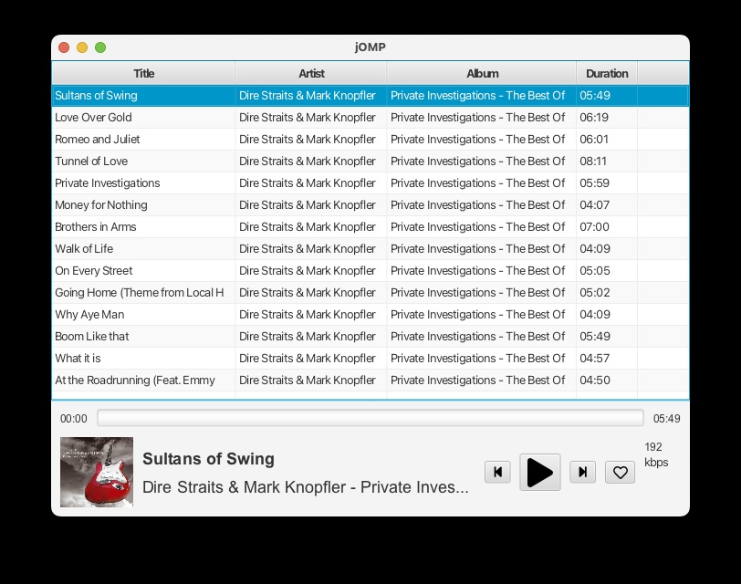

# Jens Own Music Player (jOMP) written in Java(FX)

A simple desktop music player for playing own music from local files or network.

Main criteria
- low CPU and memory footprint
- free and no ads for any subscriptions

## Motivation
I was missing a simple music player for my MacBook for listening to my private music albums located on my QNAP file server during development work at home. So this small project is useful at least for myself and I can learn some new libraries and Java 21 features.
Since I'm working on Windows machines as well, the the target system is not MacOS only bug to use this small music player on all platforms.

## Current status
The project status is roughly M1 (prototype), which means _jOMP_ can play MP3 files from a local folder for now only:

Please note: the source code needs some polishing and error handling (aka prototype) and many many unit tests ;-)

Since there are no binaries provided until now, the application needs to be compiled and started from command line with `mvnw install exec:java`.

## Core architecture and libraries
- Java 21 as platform and programming language
- [JavaFX](https://openjfx.io/) for UI and MediaPlayer
- Java Modules (JPMS) for modularization
- Jlink + JPackage for binaries
- [JUPnP](https://github.com/jupnp/jupnp) for DLNA
- [MaterialFX](https://github.com/palexdev/MaterialFX) or [JMetro](https://pixelduke.com/java-javafx-theme-jmetro/) for UI design
- [Ikonli](https://github.com/kordamp/ikonli) for Icons
- [TestFX](https://github.com/TestFX/TestFX)

## Milestones

#### M1: Prototype/MVP
- Player window with main controls
- Support at least MP3 files
- List view for playing local folder of songs
	
#### M2: DLNA + Flac
- Stream from DLNA server
- Add support for playing Flac audio (incl. high resolution)
- Favorites (local folders or DLNA folders/albums)

#### Future ideas
- Build binaries for MacOS, Windows + Linux
- Playlists (multiple playlists with multiple songs/albums)
- MacOS 14 widget
- MacOS main bar + touch bar support
- Support (build binaries for) Linux and Windows
- Some statistics of most played song/artist/album
- Fuzzy search of any song or artist by name
- Selectable light and dark skins
- Use dependency injection (e.g. Guice)
- Internationalization (at least externalization of text)
- Support other remote protocols than DLNA like SMB and FTP
- Use an event bus for internal notification instead of listeners
- Probably access musice services like [qobuz](https://www.qobuz.com/) for playing bought music directly without the need of the propriaty (if possible at all)
- GraalVM AOT compilation
- ??